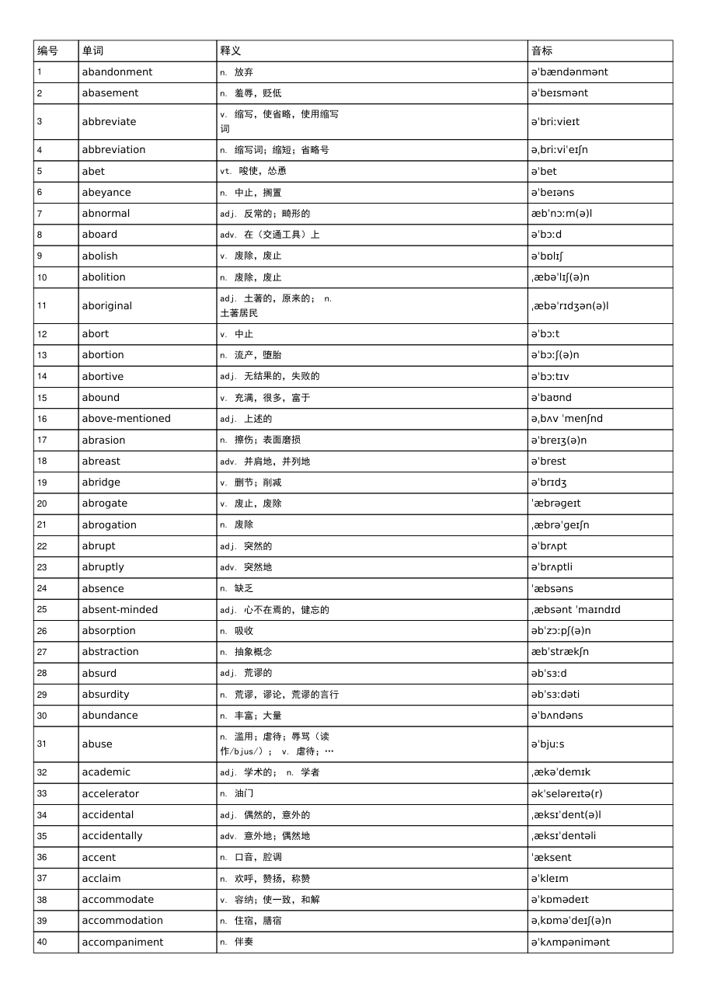

# ielts-ipa-pdf

[](https://www.python.org/)
[](./LICENSE)
[]()

给「雅思 / 英语单词」PDF 表格自动加一列**音标**，并把词表转成排版精美的 PDF。



输入：`编号 | 单词 | 释义` 格式的词汇 PDF（如雅思单词书）。
输出：`编号 | 单词 | 释义 | 音标` 的新 PDF，音标来自**有道词典（英式 ukphone）**，中英文与音标用**完整嵌入字体**渲染，避免乱码/“口口”。

## ✨ 功能

- 📄 用 `pdfplumber` 智能提取 PDF 词表，自动：
  - 跳过每页表头行；
  - 修复被换行拆开的单词（如 `accommodi\non` → `accommodation`、`boarding\nschool` → `boarding school`）；
  - **重建连续编号 1..N**（规避原 PDF 每页末行左栏编号丢失的问题）。
- 🎧 通过**有道词典接口**批量获取**英式音标**（`ukphone`），多线程 + 本地缓存，支持断点续查。
- 📐 用 `fpdf2` 生成 PDF，**完整嵌入**中文字体（`simhei.ttf`）与 IPA 字体（`DejaVuSans.ttf`），任何阅读器都能正常显示中文和音标。
- ✅ 提供 `verify.py` 校验：中文/音标是否正常、有无替换字符（口口）。

## 📁 目录结构

```
ielts-ipa-pdf/
├── SKILL.md               # VS Code Agent Skill 说明
├── assets/
│   ├── en_UK.txt          # open-dict-data/ipa-dict 英式 IPA 词典（断词用）
│   └── DejaVuSans.ttf     # IPA 字体
└── scripts/
    ├── run_all.py         # 一键：提取 → 有道音标 → 生成 PDF
    ├── extract_words.py   # 提取词表、重建编号、智能断词
    ├── youdao_ipa.py      # 有道词典批量查英式音标（多线程+缓存）
    ├── make_pdf.py        # fpdf2 生成 PDF（完整嵌入字体）
    ├── fetch_assets.py    # 下载词典/字体（资产缺失时运行）
    └── verify.py          # 校验生成 PDF 无口口
```

## 🚀 使用

### 依赖

Python 3.10+，安装：

```bash
pip install pdfplumber fpdf2 eng_to_ipa pymupdf
```

中文字体使用系统 `C:\Windows\Fonts\simhei.ttf`；若资产缺失，先运行：

```bash
python scripts/fetch_assets.py
```

### 命令行一键生成

```bash
python scripts/run_all.py --out 输出目录 雅思单词1.pdf 雅思单词2.pdf 雅思单词3.pdf
```

输出：`输出目录/words_data.json`、`youdao_cache.json`、`ipa_data.json` 以及 `<书名>_带音标.pdf`。

### 分步执行（可选）

```bash
python scripts/extract_words.py --out words_data.json 雅思单词1.pdf
python scripts/youdao_ipa.py --words words_data.json --out ipa_data.json
python scripts/make_pdf.py --data ipa_data.json --out 输出目录
```

### 校验结果

```bash
python scripts/verify.py 输出目录/雅思单词1_带音标.pdf
```

### 作为 VS Code Agent Skill

把 `SKILL.md` 放到 `~/.copilot/skills/ielts-ipa-pdf/` 下（连同 `scripts/`、`assets/`），在 VS Code 中输入 `/ielts-ipa-pdf` 或描述任务即可自动触发。

## 📝 说明

- 音标来自有道词典公开接口 `https://dict.youdao.com/jsonapi?q=<word>`，无需 API Key；请合理控制并发，脚本默认 8 线程并带重试与缓存。
- 个别生僻词/缩写有道无音标，会用本地词典或 `eng_to_ipa` 兜底，仍无则留空。
- 输出 PDF 的行高/字号可在 `scripts/make_pdf.py` 中调整。

## 📄 License

[MIT](./LICENSE)
